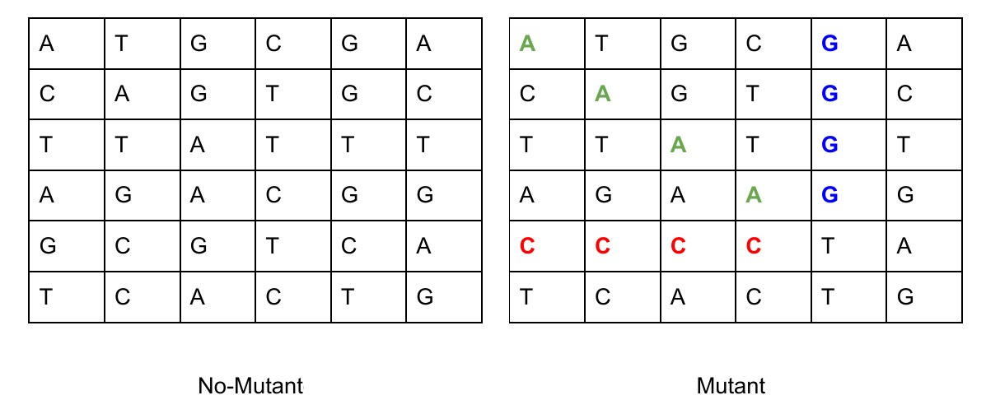

# Technical test Mercado Libre (Mutants)

[](https://www.codacy.com?utm_source=github.com&amp;utm_medium=referral&amp;utm_content=narfco/meli-mutants&amp;utm_campaign=Badge_Grade) - [](https://www.codacy.com?utm_source=github.com&utm_medium=referral&utm_content=narfco/meli-mutants&utm_campaign=Badge_Coverage) - [](https://github.com/narfco/meli-mutants/actions/workflows/test.yml)


# Objective

We need to develop an algorithm to find out if a human is a mutant,  from an array of strings, that represents a table  (NxN) with the DNA sequence. Each of these strings in the array is composed only of the nitrogenous base DNA letters (A, C, G, T).



A human DNA can be categorized as a mutant if one of the nitrogenous base letters is repeated at least 4 times in horizontal, vertical, or oblique direction.

Example of mutant DNA:

`String[] dna = {"ATGCGA","CAGTGC","TTATGT","AGAAGG","CCCCTA","TCACTG"};`

### Test goals:

1. Create an algorithm to determine if a human DNA is mutant, with below specification.

    `boolean isMutant(String[] dna);`


2. Create a REST API, with a method to determine if a human DNA is mutant, with the following characteristics, and expose it in some cloud service like GPC, AWS, etc.

   POST /mutant
   
   ```json
   {
      "dna": [
         "ATGCGA",
         "CAGTGC",
         "TTATGT",
         "AGAAGG",
         "CCCCTA",
         "TCACTG"
      ]
   }
   ```
   
   - 200 OK -> Human DNA is mutant
   - 403 FORBIDDEN -> Human DNA is not mutant

 3. Attach a database to store the verified DNA with the previous endpoint and with this information, create another service to return the statistics of all verified DNA.

   GET /stats

   ```json
   {
   "ratio": 0.4,
   "count_mutant_dna": 40,
   "count_human_dna": 100
   }
   ```
   
